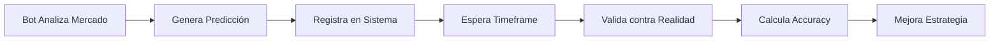
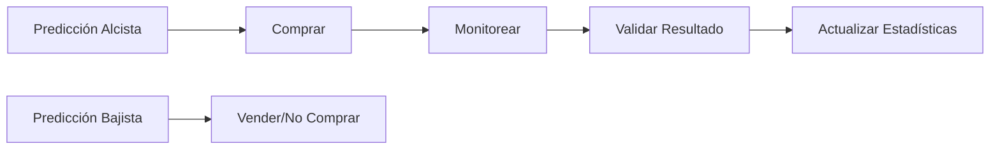

# 🤖 Sistema de Trading Automatizado - Guía Completa

## 📦 Lo que Tienes Disponible

### ✅ Funcionando AHORA (sin permisos de API):
- **[test_binance_public.py](test_binance_public.py)** - Datos de mercado en tiempo real
- **[validate_predictions.py](validate_predictions.py)** - Sistema de validación de predicciones

### 🔒 Requiere Permisos de API (para operar):
- **[auto_trader.py](auto_trader.py)** - Trading automatizado (comprar/vender)
- **[test_binance_trading.py](test_binance_trading.py)** - Tests de trading

---

## 🚀 Inicio Rápido

### 1. Obtener Datos de Mercado (FUNCIONA YA)

```bash
# Ver precios, volúmenes, order book, etc.
python test_binance_public.py
```

**Salida esperada:**
```
✅ Precio BTC/USDT: $91,196.68
✅ Top 10 por volumen
✅ Order book
✅ Trades recientes
✅ Velas/Candlesticks
```

### 2. Validar Predicciones (FUNCIONA YA)

```python
from validate_predictions import PredictionValidator

validator = PredictionValidator(testnet=True)

# Registrar predicción
validator.log_prediction(
    symbol='BTCUSDT',
    prediction_type='price_up',  # precio subirá
    predicted_value='alcista',
    timeframe_hours=24,
    context={'strategy': 'IA Gemini', 'confidence': 0.85}
)

# Después de 24 horas, validar
validator.validate_predictions()

# Ver estadísticas
validator.print_statistics()
```

**Salida esperada:**
```
📊 ESTADÍSTICAS DE PREDICCIONES

Total de predicciones validadas: 10
✅ Exitosas: 7
❌ Fallidas: 3
Tasa de éxito: 70.0%
Accuracy promedio: 75.3%

🌟 EXCELENTE - Tu bot tiene muy buenas predicciones
```

### 3. Trading Automatizado (REQUIERE PERMISOS)

```bash
# Modo interactivo
python auto_trader.py
```

**Funcionalidades:**
- Ver balances
- Comprar a precio de mercado
- Vender a precio de mercado
- Ver órdenes abiertas
- Historial de trades

---

## 🔧 Problema Actual: Permisos de API

### Estado Actual:
❌ Tu API Key NO tiene permisos habilitados
❌ No puedes comprar/vender aún
✅ Puedes ver datos públicos de mercado

### Solución: Crear Nueva API Key con Permisos

#### Opción 1: Binance Futures Testnet (MÁS FÁCIL)

1. **Abre:** https://testnet.binancefuture.com/
2. **Login con GitHub** (1 click)
3. **Perfil → API Management**
4. **Create API Key**
5. **Copiar** API Key y Secret Key
6. **Actualizar .env:**
   ```env
   BINANCE_API_KEY=tu_nueva_key
   BINANCE_SECRET_KEY=tu_nueva_secret
   BINANCE_USE_TESTNET=true
   ```
7. **Ejecutar:** `python diagnose_binance.py`

#### Opción 2: Binance Spot Testnet

1. **Abre:** https://testnet.binance.vision/
2. **Login**
3. **URL directa:** https://testnet.binance.vision/userCenter/myApiKeys.html
4. **Create API → Habilitar permisos:**
   - ✅ Enable Reading
   - ✅ Enable Spot & Margin Trading
5. **Copiar credenciales y actualizar .env**

#### ¿Links no funcionan?

Ejecuta este helper interactivo:
```bash
python help_api_keys.py
```

---

## 📚 Ejemplos de Uso

### Ejemplo 1: Validar Predicción de Análisis IA

```python
from validate_predictions import PredictionValidator

validator = PredictionValidator(testnet=True)

# Tu bot hizo un análisis con Gemini AI
# Predice que BTC subirá en las próximas 6 horas

prediction_id = validator.log_prediction(
    symbol='BTCUSDT',
    prediction_type='price_up',
    predicted_value='bullish',
    timeframe_hours=6,
    context={
        'strategy': 'Gemini AI Analysis',
        'confidence': 0.82,
        'indicators': ['RSI oversold', 'MACD bullish crossover']
    }
)

print(f"Predicción registrada: {prediction_id}")
print("Validaré automáticamente en 6 horas")
```

### Ejemplo 2: Trading Basado en Predicción

```python
from auto_trader import AutoTrader
from validate_predictions import PredictionValidator

# Inicializar
trader = AutoTrader(testnet=True)
validator = PredictionValidator(testnet=True)

# Tu bot predice que BTC subirá
# Decides comprar $100 de BTC

# 1. Registrar predicción
validator.log_prediction(
    symbol='BTCUSDT',
    prediction_type='price_up',
    predicted_value='target: 95000',
    timeframe_hours=24,
    context={'action': 'bought', 'amount': 100}
)

# 2. Ejecutar compra
order = trader.buy_market(
    symbol='BTCUSDT',
    amount_usdt=100
)

if order:
    print(f"✅ Compra exitosa: Order ID {order['orderId']}")

# Después de 24 horas...
# 3. Validar si la predicción fue correcta
validator.validate_predictions()

# 4. Ver estadísticas de accuracy
validator.print_statistics()

# Si la predicción fue correcta y quieres vender
if validator.get_statistics()['success_rate'] > 70:
    print("Tu bot tiene buen accuracy, manteniendo posición...")
else:
    print("Accuracy bajo, considera vender...")
    trader.sell_market('BTCUSDT', sell_all=True)
```

### Ejemplo 3: Bot Automático con Stop Loss

```python
from auto_trader import AutoTrader

trader = AutoTrader(testnet=True)

# Comprar BTC
trader.buy_market('BTCUSDT', amount_usdt=50)

# Obtener precio de compra
buy_price = trader.get_current_price('BTCUSDT')

# Configurar stop loss (vender si baja 5%)
stop_loss_price = buy_price * 0.95

print(f"Precio de compra: ${buy_price:,.2f}")
print(f"Stop loss: ${stop_loss_price:,.2f}")

# Monitorear (esto sería en un loop)
import time
while True:
    current_price = trader.get_current_price('BTCUSDT')

    if current_price <= stop_loss_price:
        print(f"🚨 Stop loss activado! Vendiendo...")
        trader.sell_market('BTCUSDT', sell_all=True)
        break

    time.sleep(60)  # Revisar cada minuto
```

---

## 🎯 Flujo de Trabajo Completo

### 1. Análisis → Predicción → Validación



### 2. Predicción → Trading → Resultado



---

## 📊 Métricas de Accuracy

El sistema calcula automáticamente:

- **Success Rate**: % de predicciones correctas
- **Average Accuracy**: Precisión promedio de predicciones
- **By Type**: Accuracy por tipo de predicción
- **By Symbol**: Accuracy por símbolo/crypto
- **Error Rate**: Margen de error en predicciones numéricas

### Interpretación:

| Success Rate | Evaluación | Acción |
|--------------|------------|--------|
| ≥ 70% | 🌟 Excelente | Confía en tu bot, aumenta capital |
| 50-70% | ⚠️ Aceptable | Mejora estrategia, mantén cautela |
| < 50% | ❌ Pobre | Revisa completamente tu estrategia |

---

## 🔒 Seguridad y Gestión de Riesgo

### ✅ Buenas Prácticas:

1. **SIEMPRE usa Testnet primero**
   - No arriesgues dinero real sin probar
   - Testnet tiene fondos ilimitados ficticios

2. **Validación constante**
   - Registra TODAS las predicciones
   - Valida periódicamente (diario/semanal)
   - Ajusta estrategia según accuracy

3. **Stop Loss**
   - Siempre define límite de pérdida máxima
   - Automatiza la venta si se alcanza

4. **Diversificación**
   - No pongas todo en una crypto
   - Prueba múltiples pares (BTC, ETH, BNB)

5. **Capital inicial bajo**
   - Empieza con montos pequeños
   - Aumenta gradualmente según resultados

### ❌ Evitar:

- ❌ Trading sin validación previa
- ❌ Confiar 100% en predicciones sin historial
- ❌ FOMO (Fear of Missing Out)
- ❌ Revenge trading después de pérdidas
- ❌ Usar producción sin probar en testnet

---

## 🚦 Estado del Sistema

### ✅ Funcionando (Datos Públicos):
- Precios en tiempo real
- Order book
- Trades recientes
- Velas/Candlesticks
- Estadísticas de mercado
- Top cryptos por volumen

### 🔒 Bloqueado (Requiere Permisos):
- Ver balances de cuenta
- Comprar
- Vender
- Ver historial de órdenes

### 🎯 Próximo Paso:

**Configura los permisos de API siguiendo:**
- [create_new_api_key.md](create_new_api_key.md)

O pégame aquí tus nuevas credenciales cuando las tengas.

---

## 📞 Soporte

¿Necesitas ayuda?

1. **Diagnóstico:** `python diagnose_binance.py`
2. **Helper interactivo:** `python help_api_keys.py`
3. **Guía visual:** [GUIA_VISUAL_BINANCE.md](GUIA_VISUAL_BINANCE.md)
4. **Documentación completa:** [BINANCE_TESTNET_SETUP.md](BINANCE_TESTNET_SETUP.md)

---

## 🎉 Siguientes Pasos

Una vez tengas los permisos configurados:

1. ✅ Ejecuta `python auto_trader.py`
2. ✅ Haz tu primera compra de prueba
3. ✅ Registra predicciones con `validate_predictions.py`
4. ✅ Valida accuracy de tu bot
5. ✅ Integra con tus bots de Telegram/WhatsApp
6. ✅ Automatiza reportes PDF con resultados
7. ✅ Mejora tu estrategia basándote en datos

**¡El sistema está listo para operar!** Solo falta habilitar los permisos. 🚀
